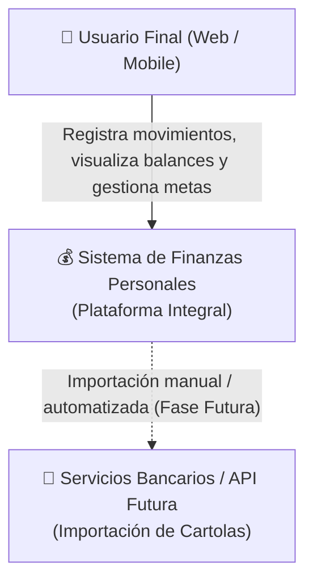
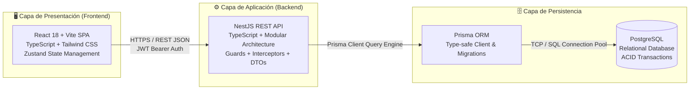
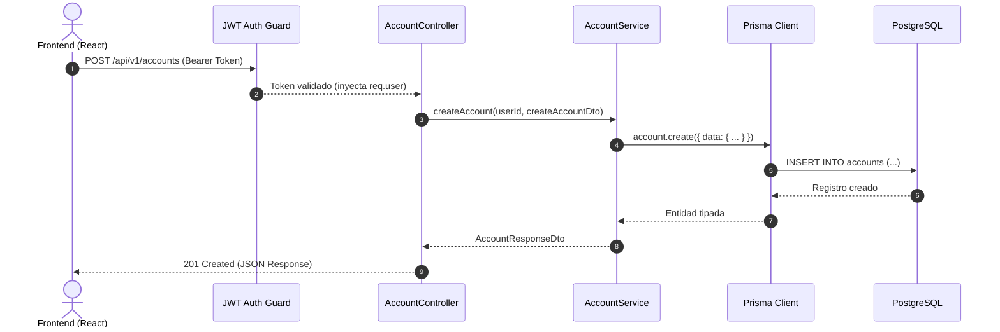

# 🏛️ Documento de Diseño del Sistema (SDD) - Arquitectura

## 1. Introducción y Propósito

El presente documento define la arquitectura técnica, los patrones de diseño y los estándares de ingeniería para la **Plataforma de Gestión de Finanzas Personales**. El sistema está concebido para ofrecer una experiencia de usuario rápida, confiable y segura tanto en dispositivos móviles como de escritorio, garantizando un registro de transacciones con mínima fricción y cálculos financieros consistentes.

---

## 2. Diagrama de Arquitectura de Alto Nivel (Modelo C4)

### 2.1. Nivel 1: Diagrama de Contexto del Sistema



### 2.2. Nivel 2: Diagrama de Contenedores



---

## 3. Arquitectura del Backend (NestJS)

La API REST se estructura siguiendo los principios de **Clean Architecture** y separación de responsabilidades por capas:

```
src/
 ├── common/                # Elementos transversales compartidos
 │    ├── decorators/       # Decoradores personalizados (@CurrentUser, @Roles)
 │    ├── filters/          # Manejador global de excepciones HTTP
 │    ├── guards/           # Guards de autenticación JWT y autorización
 │    ├── interceptors/     # Transformación de respuestas y logging de tiempos
 │    └── pipes/            # Pipes de validación y sanitización (ValidationPipe)
 ├── config/                # Carga y validación de variables de entorno (Joi/Zod)
 ├── modules/               # Módulos organizados por dominio de negocio
 │    ├── auth/             # Registro, login, refresh token, hash bcrypt
 │    ├── users/            # Perfil y preferencias de usuario (moneda base)
 │    ├── accounts/         # Cuentas bancarias, efectivo y tarjetas de crédito
 │    ├── categories/       # Categorías y subcategorías de ingresos y egresos
 │    ├── transactions/     # Movimientos financieros, transferencias y recurrentes
 │    ├── savings/          # Metas de ahorro, alcancías y aportes periódicos
 │    ├── debts/            # Deudas y préstamos P2P, calendario de vencimientos
 │    └── dashboard/        # Servicios de agregación y KPIs consolidados
 └── prisma/                # Definición del schema.prisma, migraciones y seeds
```

### 3.1. Flujo de Procesamiento de una Petición



---

## 4. Arquitectura del Frontend (React + Vite)

El frontend sigue un enfoque **Feature-Sliced Design simplificado**, desacoplando fuertemente los componentes de vista de la lógica de negocio y de red.

### 4.1. Estructura de Directorios

```
src/
 ├── assets/                # Logos, ilustraciones, iconos estáticos
 ├── components/            # UI Kit agnóstico de dominio (Botones, Modales, Inputs, Badges)
 ├── features/              # Módulos de funcionalidad de negocio
 │    ├── auth/             # Login, registro, recuperación de clave
 │    ├── accounts/         # Listado de tarjetas, creación de cuentas, detalles
 │    ├── transactions/     # Modal de registro rápido, tabla filtrable de movimientos
 │    ├── savings/          # Cards de metas de ahorro, barra de progreso, modal de aportes
 │    ├── debts/            # Lista de préstamos/deudas, calculadora de abonos
 │    └── dashboard/        # Gráficos Recharts, métricas y cards de balance
 ├── layouts/               # Layouts principales: AppLayout (Sidebar + BottomNav), AuthLayout
 ├── routes/                # Configuración de React Router (rutas públicas y privadas)
 ├── services/              # Cliente HTTP configurado con Axios e interceptores de token
 ├── store/                 # Slices de Zustand (authStore, themeStore, uiStore)
 ├── types/                 # Tipos TypeScript compartidos (DTOs, Enums, Modelos)
 └── utils/                 # Helpers (formato de moneda, fechas, validaciones)
```

### 4.2. Patrón de Responsabilidades en Componentes

1. **Presentational Components (UI Pura):** No conocen Axios ni Zustand; reciben datos vía `props` y emiten eventos vía `callbacks`.
2. **Feature Components (Contenedores):** Agrupan los componentes presentacionales para una vista específica.
3. **Custom Hooks:** Encapsulan el estado local, mutaciones de React Query / Axios y validaciones de formularios (ej. `useQuickTransactionForm()`, `useSavingsGoal()`).

---

## 5. Estrategia de Seguridad y Datos

| Dimensión | Estrategia Implementada |
| :--- | :--- |
| **Autenticación** | JWT con Access Token (corta duración: 15 min) y Refresh Token (7 días) almacenado en HTTP-Only Cookie. |
| **Almacenamiento de Contraseñas** | Hashing con `bcrypt` (factor de costo: 12). Nunca se persisten contraseñas en texto plano. |
| **Autorización y Tenancy** | Todas las consultas a la base de datos están forzadas a filtrar por `userId` del token autenticado para garantizar aislamiento estricto de datos. |
| **Precisión Monetaria** | Uso estricto del tipo `Decimal(14, 2)` en PostgreSQL y `Prisma.Decimal` / `decimal.js` en código para eliminar errores de redondeo de punto flotante de IEEE 754. |
| **Protección contra Inyecciones** | Uso exclusivo de consultas parametrizadas a través de Prisma ORM. |
| **Validación de Entradas** | `ValidationPipe` global con `{ whitelist: true, forbidNonWhitelisted: true }` para descartar campos no esperados. |
| **CORS** | Políticas restrictivas configuradas exclusivamente para el dominio del frontend. |

---

## 6. Cumplimiento de Guías de Desarrollo (Reglas del Proyecto)

En estricta concordancia con la sección 5 del archivo de requerimientos base:

1. **Modo Estricto de TypeScript (`"strict": true`):** Prohibido terminantemente el uso de `any`. Se emplea `unknown`, genéricos tipados o tipos de utilidad (`Partial`, `Pick`, `Omit`).
2. **Estilado:** 100% mediante clases de utilidad de Tailwind CSS. Cero estilos en línea (`style={{...}}`).
3. **GitFlow y Conventional Commits:** Todo commit sigue la especificación `feat:`, `fix:`, `chore:`, `refactor:`, `docs:`, `test:`.
4. **Testing Obligatorio:** Cobertura de tests unitarios para servicios y utilidades matemáticas, más tests de integración E2E para flujos críticos.
