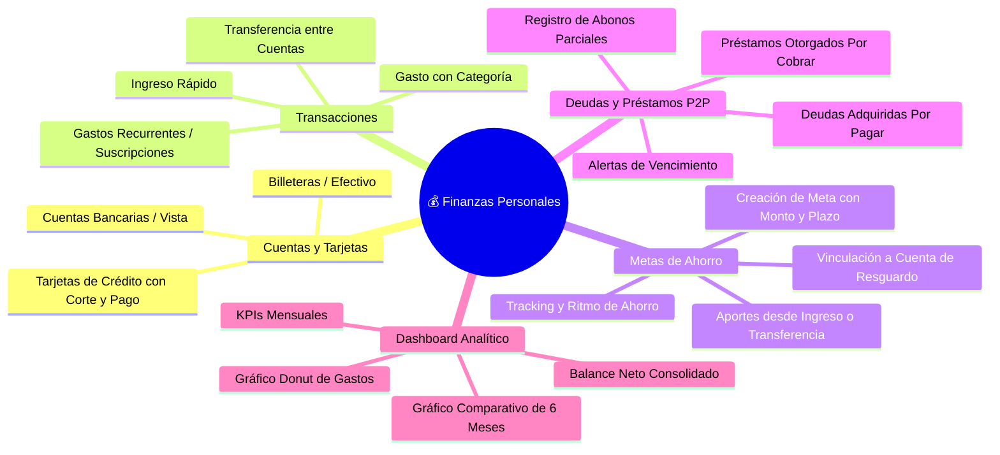

# 🎯 Funcionalidades y Alcance del Producto (MVP y Futuras Fases)

## 1. Filosofía del Producto

El objetivo central de la plataforma es **eliminar la fricción de entrada de datos**. La mayoría de los usuarios abandona las apps de finanzas porque registrar un gasto toma más de 10 segundos o requiere demasiados clics. Esta plataforma prioriza:
1. **Flujo de registro ultra veloz** (< 5 segundos desde móvil o escritorio).
2. **Claridad inmediata del dinero real disponible**.
3. **Visibilidad de metas y compromisos (deudas y ahorros)** sin saturación visual.

---

## 2. Alcance Funcional del MVP

---

## 3. Detalle de Módulos Funcionales

### 3.1. Gestión de Cuentas, Billeteras y Tarjetas (Soporte Bimoneda CLP/USD)

Permite modelar con precisión la realidad financiera del usuario:
* **Soporte Multimoneda nativo (CLP y USD):**
  * Cada cuenta se define con su divisa: **CLP** (Pesos Chilenos, formateado sin decimales, ej. `$2.000.000`) o **USD** (Dólares, formateado con centavos, ej. `$1,450.50`).
  * Los balances se calculan por divisa para evitar distorsiones contables.
* **Tipos de Cuenta soportados:**
  * **Cuenta Bancaria / Vista / Débito:** Saldo líquido disponible para compras directas.
  * **Cuenta en Dólares:** Saldo en USD para ahorros internacionales o compras en el extranjero.
  * **Tarjeta de Crédito:** Registra límite total de crédito, cupo utilizado, cupo disponible, día de corte de facturación y día límite de pago.
  * **Efectivo / Billetera Física:** Control del dinero en mano.
  * **Cuenta de Ahorro / Inversión:** Fondos destinados a resguardar metas.
* **Propiedades configurables:** Nombre, moneda (`CLP` / `USD`), color distintivo, icono y saldo inicial.

---

### 3.2. Módulo de Metas de Ahorro (Feature Clave)

Diseñado para planificar objetivos financieros concretos (ejemplo: *"Viaje a Brasil - $2.000.000"*).

#### Características principales:
1. **Definición de Meta y Asociación Flexible de Cuentas:**
   * **Nombre descriptivo:** Ej. *Vacaciones Brasil 2027*, *Fondo de Emergencia*, *Pie para Auto*.
   * **Monto Objetivo:** Meta monetaria a alcanzar en la moneda de la cuenta asociada.
   * **Fecha Límite (Target Date):** Plazo previsto para cumplir la meta.
   * **Cuenta de Resguardo (Relación 1 a N):** **Múltiples metas pueden convivir dentro de la misma cuenta bancaria** (ej. la cuenta *Ahorro Banco Estado* puede resguardar simultáneamente `$650.000` para *Viaje a Brasil* y `$500.000` para *Fondo de Emergencia*).
   * **Categoría / Color / Icono:** Identificadores visuales.

2. **Acciones Directas en la Meta (Ingreso y Egreso de Emergencia):**
   * **Aporte / Ingreso al Ahorro:** Incrementar el capital de la meta transfiriendo fondos desde otra cuenta o asignando saldo.
   * **Retiro / Egreso por Emergencia:** Permite liberar y retirar fondos de la meta hacia la cuenta activa justificando el motivo en caso de urgencia imprevista.
   * **Asignación directa desde Ingresos principales:** Al registrar cualquier ingreso general en la aplicación (ej. sueldo, bono freelance, venta), el usuario puede marcar la casilla *"Destinar directo a una meta de ahorro"* para transferirlo sin pasos intermedios.

3. **Inteligencia y Ritmo de Ahorro (Pacing):**
   * Cálculo automático del **aporte mensual recomendado**:
     $$\text{Aporte Mensual} = \frac{\text{Monto Restante}}{\text{Meses Restantes}}$$
   * Indicador visual de ritmo: *"Al día"*, *"Acelerado"* o *"Retrasado"*.
   * Barra de progreso porcentual (`0%` a `100%`) con hitos intermedios (25%, 50%, 75%).

4. **Saldo Disponible vs. Saldo Reservado en Cuentas:**
   * En cada cuenta se distingue con total claridad:
     * **Saldo Total en Cuenta:** Todo el dinero depositado en el banco.
     * **Saldo Reservado en Metas:** Suma de las metas asociadas a esa cuenta.
     * **Saldo Libre / Gastable:** Saldo total menos los ahorros comprometidos, protegiendo al usuario de gastar sus metas por error.

---

### 3.3. Transacciones Rápidas (Ingresos, Gastos y Transferencias)

* **Registro en 3 clics:**
  1. Pulsar botón flotante o atajo de teclado (`N`).
  2. Digitar monto.
  3. Elegir categoría y cuenta (con sugerencias inteligentes basadas en el historial).
* **Categorías y Subcategorías preconfiguradas:**
  * Egresos: Alimentación, Transporte, Vivienda, Salud, Ocio, Educación, Servicios básicos.
  * Ingresos: Salario, Honorarios, Inversiones, Ventas, Reembolsos.
* **Transacciones Recurrentes:**
  * Soporte para pagos mensuales (ej. Netflix, Spotify, Arriendo, Pago de Sueldo).
  * Generación programada o recordatorio con un clic para confirmar ejecución.

---

### 3.4. Deudas y Préstamos Entre Personas (P2P)

Diseñado para no olvidar dinero prestado ni deudas con amigos o familiares:
* **Préstamos Otorgados (Por Cobrar):**
  * Nombre de la persona o contacto.
  * Monto prestado y cuenta origen de donde salió el dinero.
  * Fecha pactada de devolución.
  * Registro de abonos parciales (ej. me devolvió $50.000 de $200.000).
* **Deudas Adquiridas (Por Pagar):**
  * Acreedor, monto adeudado, fecha de vencimiento y tasa de interés (opcional).
* **Alertas Visuales:**
  * Marcador de urgencia para compromisos que vencen en los próximos 7 y 14 días.
  * Estado automático: `Pendiente`, `Abonada Parcial`, `Completada` o `Vencida`.

---

### 3.5. Dashboard y Métricas de Control

* **Balance Consolidado en Tiempo Real:**
  * $\text{Patrimonio Neto} = \text{Activos (Cuentas + Efectivo + Ahorros)} - \text{Pasivos (Deudas por pagar + Saldo adeudado en tarjetas)}$.
* **KPIs Mensuales:**
  * Total Ingresos vs Total Egresos del mes en curso.
  * Tasa de Ahorro del mes ($\frac{\text{Ahorro Mensual}}{\text{Ingresos Mensuales}} \times 100$).
* **Gráficos Interactivos:**
  * **Donut Chart:** Distribución porcentual de gastos por categoría.
  * **Bar Chart Comparativo:** Ingresos vs Gastos vs Ahorro de los últimos 6 meses.
  * **Widget de Metas:** Carrusel o tarjetas con el progreso de las 3 metas más próximas.
  * **Timeline de Vencimientos:** Lista cronológica de pagos de tarjetas y cobro/pago de deudas en los próximos 15 días.

---

## 4. Matriz de Priorización MVP vs Futuras Fases

| Funcionalidad | MVP (Fase 1) | Fase 2 | Fase 3 |
| :--- | :---: | :---: | :---: |
| CRUD de Cuentas y Tarjetas | ✅ | - | - |
| Registro de Ingresos y Gastos | ✅ | - | - |
| Metas de Ahorro con Cuentas Vinculadas | ✅ | - | - |
| Deudas y Préstamos P2P con Abonos | ✅ | - | - |
| Dashboard con Gráficos Recharts | ✅ | - | - |
| Modo Oscuro y Responsive Mobile/Desktop | ✅ | - | - |
| Presupuestos Mensuales con Alertas de Límite | ⏳ | ✅ | - |
| Manejo de Compras en Cuotas en Tarjetas | ⏳ | ✅ | - |
| Exportación de Datos a CSV / Excel | ⏳ | ✅ | - |
| Soporte Multimoneda con Tipo de Cambio | ⏳ | ⏳ | ✅ |
| Importación Inteligente de Cartolas Bancarias (CSV/PDF) | ⏳ | ⏳ | ✅ |
| Escaneo OCR de Boletas y Tickets con IA | ⏳ | ⏳ | ✅ |
