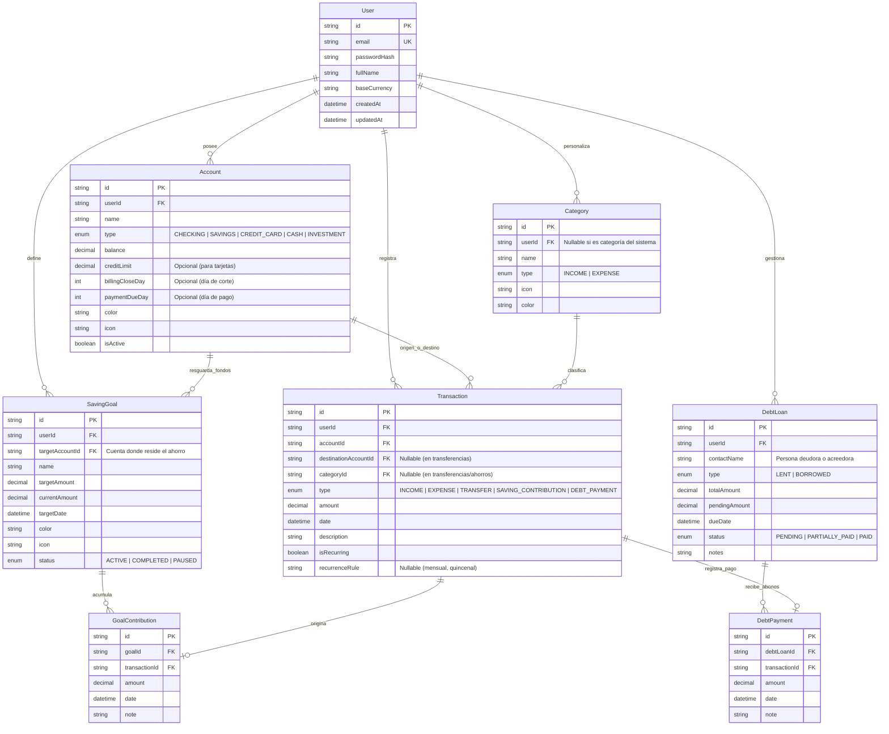

# ⚙️ Especificaciones Técnicas y Modelo de Datos

## 1. Modelo de Base de Datos y Diagrama Entidad-Relación (ERD)

La base de datos utiliza **PostgreSQL** y se gestiona mediante **Prisma ORM**. Todas las cantidades monetarias se modelan como `Decimal(14, 2)` para evitar imprecisiones de coma flotante.



---

## 2. Esquema Completo de Prisma (`schema.prisma`)

```prisma
datasource db {
  provider = "postgresql"
  url      = env("DATABASE_URL")
}

generator client {
  provider = "prisma-client-js"
}

enum Currency {
  CLP
  USD
}

enum AccountType {
  CHECKING       // Cuenta Corriente / Vista
  SAVINGS        // Cuenta de Ahorro / Bolsillo
  CREDIT_CARD    // Tarjeta de Crédito
  CASH           // Efectivo
  INVESTMENT     // Fondos Mutuos / Acciones
}

enum TransactionType {
  INCOME              // Ingreso general
  EXPENSE             // Egreso / Compra
  TRANSFER            // Movimiento entre cuentas propias
  SAVING_CONTRIBUTION // Aporte / Ingreso a meta de ahorro
  SAVING_WITHDRAWAL   // Retiro / Egreso de ahorro por emergencia
  DEBT_PAYMENT        // Abono o pago de deuda
}

enum CategoryType {
  INCOME
  EXPENSE
}

enum GoalStatus {
  ACTIVE
  COMPLETED
  PAUSED
}

enum DebtType {
  LENT      // Dinero que presté (por cobrar)
  BORROWED  // Dinero que me prestaron (por pagar)
}

enum DebtStatus {
  PENDING
  PARTIALLY_PAID
  PAID
}

model User {
  id           String        @id @default(uuid())
  email        String        @unique
  passwordHash String
  fullName     String
  baseCurrency Currency      @default(CLP)
  createdAt    DateTime      @default(now())
  updatedAt    DateTime      @updatedAt

  accounts     Account[]
  categories   Category[]
  transactions Transaction[]
  savingGoals  SavingGoal[]
  debtLoans    DebtLoan[]

  @@map("users")
}

model Account {
  id              String      @id @default(uuid())
  userId          String
  name            String
  type            AccountType
  currency        Currency    @default(CLP)
  balance         Decimal     @default(0.0) @db.Decimal(14, 2)
  creditLimit     Decimal?    @db.Decimal(14, 2)
  billingCloseDay Int?        // 1 al 31
  paymentDueDay   Int?        // 1 al 31
  color           String      @default("#3B82F6")
  icon            String      @default("wallet")
  isActive        Boolean     @default(true)
  createdAt       DateTime    @default(now())
  updatedAt       DateTime    @updatedAt

  user                  User          @relation(fields: [userId], references: [id], onDelete: Cascade)
  originTransactions    Transaction[] @relation("OriginAccount")
  destTransactions      Transaction[] @relation("DestinationAccount")
  savingGoals           SavingGoal[]  @relation("TargetSavingsAccount")

  @@index([userId])
  @@map("accounts")
}

model Category {
  id        String       @id @default(uuid())
  userId    String?      // Opcional si es categoría global predeterminada
  name      String
  type      CategoryType
  icon      String       @default("tag")
  color     String       @default("#6B7280")
  createdAt DateTime     @default(now())

  user         User?         @relation(fields: [userId], references: [id], onDelete: Cascade)
  transactions Transaction[]

  @@index([userId])
  @@map("categories")
}

model Transaction {
  id                   String          @id @default(uuid())
  userId               String
  accountId            String
  destinationAccountId String?
  categoryId           String?
  type                 TransactionType
  amount               Decimal         @db.Decimal(14, 2)
  date                 DateTime        @default(now())
  description          String
  isRecurring          Boolean         @default(false)
  recurrenceRule       String?
  createdAt            DateTime        @default(now())
  updatedAt            DateTime        @updatedAt

  user                 User              @relation(fields: [userId], references: [id], onDelete: Cascade)
  account              Account           @relation("OriginAccount", fields: [accountId], references: [id])
  destinationAccount   Account?          @relation("DestinationAccount", fields: [destinationAccountId], references: [id])
  category             Category?         @relation(fields: [categoryId], references: [id])
  goalContributions    GoalContribution[]
  debtPayments         DebtPayment[]

  @@index([userId, date])
  @@map("transactions")
}

model SavingGoal {
  id              String       @id @default(uuid())
  userId          String
  targetAccountId String
  name            String
  targetAmount    Decimal      @db.Decimal(14, 2)
  currentAmount   Decimal      @default(0.0) @db.Decimal(14, 2)
  targetDate      DateTime
  color           String       @default("#10B981")
  icon            String       @default("target")
  status          GoalStatus   @default(ACTIVE)
  createdAt       DateTime     @default(now())
  updatedAt       DateTime     @updatedAt

  user          User               @relation(fields: [userId], references: [id], onDelete: Cascade)
  targetAccount Account            @relation("TargetSavingsAccount", fields: [targetAccountId], references: [id])
  contributions GoalContribution[]

  @@index([userId])
  @@map("saving_goals")
}

model GoalContribution {
  id            String      @id @default(uuid())
  goalId        String
  transactionId String?
  amount        Decimal     @db.Decimal(14, 2)
  date          DateTime    @default(now())
  note          String?
  createdAt     DateTime    @default(now())

  goal        SavingGoal   @relation(fields: [goalId], references: [id], onDelete: Cascade)
  transaction Transaction? @relation(fields: [transactionId], references: [id], onDelete: SetNull)

  @@index([goalId])
  @@map("goal_contributions")
}

model DebtLoan {
  id            String      @id @default(uuid())
  userId        String
  contactName   String
  type          DebtType
  totalAmount   Decimal     @db.Decimal(14, 2)
  pendingAmount Decimal     @db.Decimal(14, 2)
  dueDate       DateTime?
  status        DebtStatus  @default(PENDING)
  notes         String?
  createdAt     DateTime    @default(now())
  updatedAt     DateTime    @updatedAt

  user     User          @relation(fields: [userId], references: [id], onDelete: Cascade)
  payments DebtPayment[]

  @@index([userId, status])
  @@map("debt_loans")
}

model DebtPayment {
  id            String      @id @default(uuid())
  debtLoanId    String
  transactionId String?
  amount        Decimal     @db.Decimal(14, 2)
  date          DateTime    @default(now())
  note          String?
  createdAt     DateTime    @default(now())

  debtLoan    DebtLoan     @relation(fields: [debtLoanId], references: [id], onDelete: Cascade)
  transaction Transaction? @relation(fields: [transactionId], references: [id], onDelete: SetNull)

  @@index([debtLoanId])
  @@map("debt_payments")
}
```

---

## 3. Catálogo de Endpoints de la API REST

Prefijo global de versión: `/api/v1`

### 3.1. Autenticación (`/auth`)
* `POST /auth/register` - Registro de nuevo usuario (nombre, email, clave).
* `POST /auth/login` - Inicio de sesión (retorna token JWT y setea cookie con refresh token).
* `POST /auth/refresh` - Renovación del access token.
* `GET /auth/me` - Perfil del usuario autenticado.

### 3.2. Cuentas y Tarjetas (`/accounts`)
* `GET /accounts` - Lista de cuentas con saldos calculados.
* `POST /accounts` - Crea una nueva cuenta / tarjeta de crédito.
* `PATCH /accounts/:id` - Actualiza detalles o límite de crédito.
* `DELETE /accounts/:id` - Desactiva/elimina una cuenta (si no tiene transacciones bloqueantes).

### 3.3. Transacciones (`/transactions`)
* `GET /transactions` - Listado paginado con filtros (`startDate`, `endDate`, `accountId`, `categoryId`, `type`).
* `POST /transactions` - Registro de transacción (Ingreso, Gasto o Transferencia).
  * *Efecto colateral:* Actualiza atómicamente el saldo de la cuenta origen (y destino si es transferencia) en una transacción de base de datos (`$transaction`).
* `GET /transactions/:id` - Detalle de un movimiento.
* `DELETE /transactions/:id` - Elimina un movimiento y revierte el balance de la cuenta.

### 3.4. Metas de Ahorro (`/savings`)
* `GET /savings` - Lista de metas activas con porcentaje de progreso y ritmo mensual.
* `POST /savings` - Crea una nueva meta (ej. *Viaje a Brasil*).
* `POST /savings/:id/contribute` - Registra un aporte (genera transacción vinculada y descuenta de cuenta origen si aplica).
* `POST /savings/:id/withdraw` - Registra un retiro de ahorro.
* `PATCH /savings/:id` - Modifica meta o fecha estimada.

### 3.5. Deudas y Préstamos P2P (`/debts`)
* `GET /debts` - Lista de préstamos otorgados y deudas adquiridas con cálculo de días para vencer.
* `POST /debts` - Registra nuevo préstamo o deuda.
* `POST /debts/:id/payments` - Registra un abono parcial o total (reduce `pendingAmount`).
* `PATCH /debts/:id` - Modifica notas o fecha de vencimiento.

### 3.6. Dashboard y Analítica (`/dashboard`)
* `GET /dashboard/summary` - Resumen de balance neto, ingresos del mes, egresos del mes y ahorro acumulado.
* `GET /dashboard/expenses-by-category?month=YYYY-MM` - Desglose para gráfico Donut.
* `GET /dashboard/historical-trend?months=6` - Datos históricos para gráfico de barras comparativo.
* `GET /dashboard/upcoming-dues` - Próximas deudas por cobrar/pagar y fechas de corte de tarjetas en los próximos 15 días.
