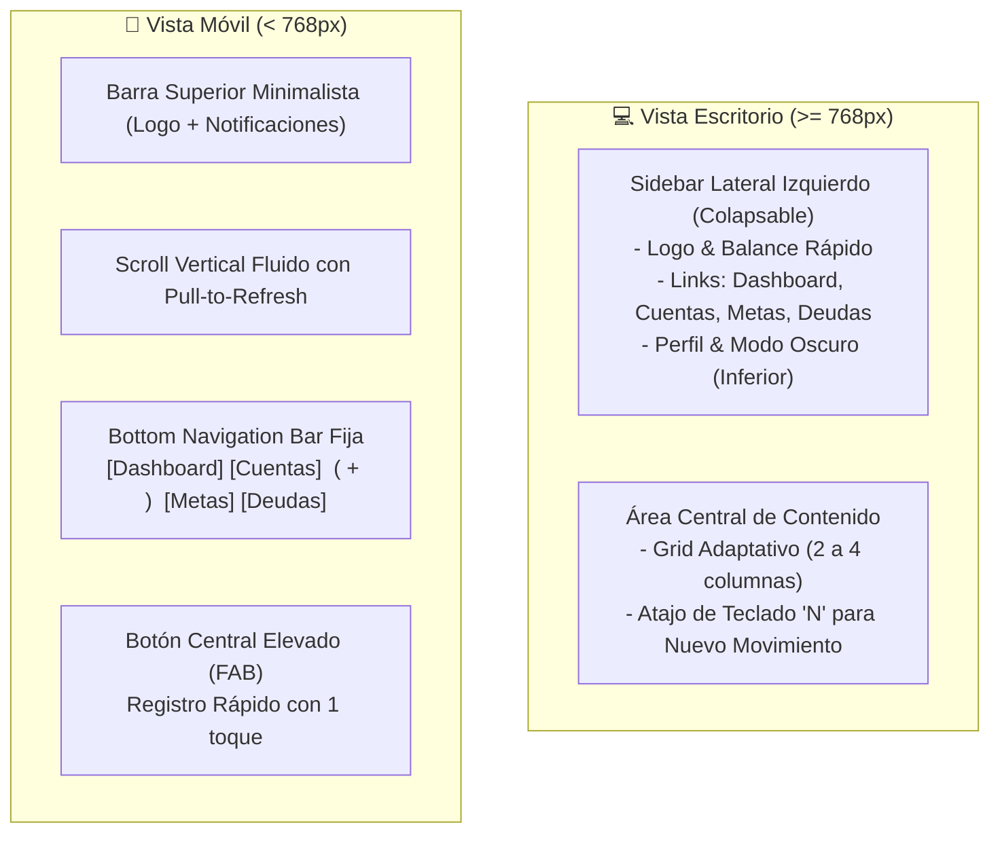

# 🎨 Guía de Diseño, Experiencia de Usuario (UI/UX) y Componentes

## 1. Principios de Experiencia de Usuario (UX)

1. **Velocidad de Carga y Acción:** La tarea más frecuente (registrar un gasto) debe completarse en menos de 5 segundos.
2. **Zona del Pulgar (Mobile Thumb-Zone):** Los elementos críticos de navegación e interacción en dispositivos móviles se sitúan en la mitad inferior de la pantalla.
3. **Cero Ambigüedad Financiera:** Los números y balances deben ser claros, con alineación tabular (`tabular-nums`) para evitar saltos visuales al comparar cifras.
4. **Retroalimentación Inmediata:** Modales optimistas y micro-interacciones al guardar transacciones o registrar aportes a metas.

---

## 2. Sistema de Diseño (Design Tokens con Tailwind CSS)

### 2.1. Paleta de Colores Semántica

| Rol | Clase Tailwind (Modo Claro) | Clase Tailwind (Modo Oscuro) | Uso |
| :--- | :--- | :--- | :--- |
| **Fondo Principal** | `bg-slate-50` | `bg-slate-950` | Fondo general de la aplicación |
| **Superficie de Tarjeta** | `bg-white` | `bg-slate-900` | Tarjetas, contenedores, modales |
| **Bordes** | `border-slate-200` | `border-slate-800` | Divisores y contornos suaves |
| **Texto Primario** | `text-slate-900` | `text-slate-50` | Títulos y cifras principales |
| **Texto Secundario** | `text-slate-500` | `text-slate-400` | Fechas, subtítulos, etiquetas |
| **Positivo / Ingreso** | `text-emerald-600` / `bg-emerald-50` | `text-emerald-400` / `bg-emerald-950/40` | Ingresos, metas cumplidas, saldos a favor |
| **Negativo / Gasto** | `text-rose-600` / `bg-rose-50` | `text-rose-400` / `bg-rose-950/40` | Gastos, deudas por pagar, alertas críticas |
| **Ahorro / Metas** | `text-teal-600` / `bg-teal-50` | `text-teal-400` / `bg-teal-950/40` | Metas de ahorro, fondos reservados |
| **Acento Primario** | `bg-indigo-600` hover `bg-indigo-700` | `bg-indigo-500` hover `bg-indigo-600` | Botones de acción principal (CTA) |

### 2.2. Tipografía y Estilos Visuales
* **Familia Tipográfica:** `Inter`, `system-ui`, sans-serif.
* **Cifras Monetarias:** Clase obligatoria `tabular-nums font-semibold` para garantizar alineación de dígitos verticales.
* **Bordes y Sombras:** Estilo moderno suave (`rounded-2xl`, `shadow-sm` con transiciones `transition-all duration-200 ease-in-out`).

---

## 3. Arquitectura de Navegación Responsive



---

## 4. Especificación de Componentes Clave

### 4.1. Tarjeta de Meta de Ahorro (`SavingGoalCard`)

Componente interactivo para mostrar el avance de cada objetivo:
* **Cabecera:** Icono temático (ej. 🌴 para *Viaje a Brasil*), nombre de la meta y cuenta donde está resguardado el dinero (ej. *Ahorro Banco Estado*).
* **Cifras:**
  * Monto acumulado actual (ej. `$650.000`) vs Meta objetivo (ej. `$2.000.000`).
* **Barra de Progreso:**
  * Barra con degradado `bg-gradient-to-r from-teal-500 to-emerald-500`.
  * Indicador de porcentaje flotante (`32.5%`).
* **Badge de Ritmo / Pacing:**
  * Ej. *"Ahorro sugerido: $112.500/mes para llegar a Diciembre 2027"*.
* **Acciones rápidas integradas:**
  * Botón `+ Aportar`: Despliega modal para abonar saldo al instante desde otra cuenta bancaria.
  * Botón `⚠️ Retiro de Emergencia`: Modal para retirar fondos de la meta hacia la cuenta activa justificando el motivo en caso de imprevisto urgente.

```
┌────────────────────────────────────────────────────────┐
│ 🌴  Viaje a Brasil          [Activa] [+ Aportar] [Retirar] │
│ Cuenta: Banco Estado Ahorro Premium                    │
├────────────────────────────────────────────────────────┤
│ $650.000 / $2.000.000                         (32.5%)  │
│ [████████████░░░░░░░░░░░░░░░░░░░░░░░░░░░░░░░░░░░░░░░░] │
├────────────────────────────────────────────────────────┤
│ ⏱️ Faltan 12 meses • Ritmo recomendado: $112.500 / mes  │
└────────────────────────────────────────────────────────┘
```

---

### 4.2. Modal de Transacción Rápida (`QuickTransactionModal`)

El modal se abre de inmediato desde el FAB móvil o el botón principal de escritorio:
1. **Tabs superiores segmentados:** `[ Gasto ]` | `[ Ingreso ]` | `[ Transferencia ]` | `[ Aporte a Meta ]`.
2. **Display de Monto Grande:**
   * Input de texto con tamaño gigante (`text-4xl text-center font-bold`), formateado automáticamente según la divisa:
     * **CLP:** Sin decimales con separador de miles (`$ 2.000.000`).
     * **USD:** Con 2 decimales (`$ 1,250.00`).
3. **Pills de Categoría:** Selector rápido con iconos (Comida 🍔, Super 🛒, Transporte 🚗, Sueldo 💼, etc.).
4. **Selector de Cuenta:** Chips horizontales mostrando el saldo actual de cada tarjeta/cuenta.
5. **Toggle inteligente "Destinar a Meta de Ahorro":** Al registrar un **Ingreso**, permite marcar un switch y seleccionar la meta de ahorro destino para que el dinero quede automáticamente resguardado en dicha meta.
6. **Fecha y Nota (Opcional):** Por defecto toma la fecha y hora actual; campo de descripción con autocompletado de movimientos frecuentes.
7. **Botón Guardar:** Animación de confirmación háptica/visual al guardar.

---

### 4.3. Tarjeta de Deuda o Préstamo (`DebtCard`)

* **Identificación del Tipo:**
  * Verde suave si es **"Por Cobrar"** (Préstamo otorgado a amigo/familiar).
  * Ámbar o rojo suave si es **"Por Pagar"** (Deuda asumida).
* **Monto:** Saldo pendiente destacado en negrita y total inicial en texto secundario.
* **Vencimiento:** Etiqueta dinámica:
  * Verde: *"Vence en 20 días"*.
  * Ámbar: *"Vence en 3 días"*.
  * Rojo parpadeante: *"Vencida hace 2 días"*.
* **Botón de Abono Rápido:** Permite registrar que la persona devolvió una parte del dinero y actualizar el balance de la cuenta receptora.

---

### 4.4. Dashboard: Gráficos y Métricas Principales

* **Bloque Superior (KPIs):**
  * **Patrimonio Líquido Disponible:** Saldo en cuentas menos saldo reservado en metas de ahorro.
  * **Ingresos del Mes:** Sumatoria con comparativa respecto al mes anterior ($\uparrow 8\%$).
  * **Gastos del Mes:** Con barra de consumo si existe presupuesto mensual.
  * **Ahorro Activo Total:** Suma de todas las alcancías y metas.
* **Gráfico de Donut (Recharts):**
  * Desglose interactivo de categorías de gasto.
  * Leyenda con montos y porcentajes al pasar el cursor o pulsar en móvil.
* **Gráfico de Barras Comparativo (6 meses):**
  * Barras agrupadas: Verde (Ingresos), Rojo (Egresos), Teal (Aportes a Ahorro).
