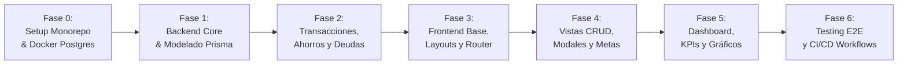

# 🚀 Plan de Desarrollo y Roadmap de Implementación

Este plan divide el desarrollo del proyecto en fases incrementales y verificables. Cada fase culmina con entregables concretos y pruebas de funcionamiento antes de avanzar a la siguiente.

---

## 1. Metodología y Reglas de Desarrollo

En estricto apego a las **Guías de Desarrollo y Arquitectura** (Sección 5):
* **Commits:** Obligatorio seguir el estándar de **Conventional Commits**:
  * `feat: ...` para nuevas funcionalidades.
  * `fix: ...` para resolución de bugs.
  * `refactor: ...` para reestructuraciones de código sin cambio de comportamiento.
  * `test: ...` para añadir o corregir pruebas.
  * `chore: ...` para dependencias, linters o configuración.
* **Calidad de Código:**
  * Cero advertencias de linter y formato (`eslint`, `prettier`).
  * Tipado TypeScript 100% estricto sin uso de `any`.
  * Estilado 100% con clases de Tailwind CSS sin estilos en línea.
* **Flujo de Ramas:**
  * Rama `main`: Código estable de producción.
  * Ramas `feature/<nombre>` para el desarrollo de cada fase.

---

## 2. Fases de Ejecución

---

### 📋 Fase 0: Inicialización del Entorno y Arquitectura Base
* **Objetivos:**
  * Crear estructura de monorepo o carpetas `/backend` y `/frontend`.
  * Configurar `docker-compose.yml` para levantar PostgreSQL localmente.
  * Configurar `tsconfig.json` con `"strict": true` en ambos proyectos.
  * Configurar ESLint y Prettier consistentes.
* **Entregables:**
  * Contenedor de PostgreSQL corriendo en puerto `5432`.
  * Backend NestJS inicializado con `@nestjs/cli`.
  * Frontend React 18 inicializado con Vite, TypeScript y Tailwind CSS configurado.
* **Criterio de Aceptación (DoD):**
  * `npm run build` exitoso tanto en backend como en frontend.

---

### 📋 Fase 1: Backend Core, Base de Datos y Autenticación
* **Objetivos:**
  * Configurar Prisma ORM y migración inicial del esquema completo.
  * Generar semillas de datos (`prisma/seed.ts`) con categorías por defecto (Alimentación, Sueldo, Transporte, etc.).
  * Módulo `Auth`: Registro de usuario, login con JWT, hashing de contraseñas con `bcrypt`.
  * Módulo `Users`: Perfil y preferencias (moneda base).
  * Módulo `Accounts`: CRUD de cuentas y tarjetas de crédito con cálculo de saldo.
* **Entregables:**
  * Migraciones ejecutadas en PostgreSQL.
  * Endpoints `/auth/*` y `/accounts/*` testeados y funcionando.
* **Criterio de Aceptación (DoD):**
  * Pruebas unitarias de `AuthService` y `AccountService` con mocks pasando al 100%.

---

### 📋 Fase 2: Lógica Financiera (Transacciones, Metas de Ahorro y Deudas)
* **Objetivos:**
  * Módulo `Transactions`:
    * Registro de Ingresos, Gastos y Transferencias entre cuentas.
    * Actualización atómica de saldos en BD mediante `prisma.$transaction`.
  * Módulo `Savings`:
    * Creación de metas de ahorro (ej. *Viaje a Brasil*).
    * Endpoints para registrar aportes y retiros, calculando ritmo mensual y porcentaje.
    * Vinculación de cuenta donde reside el dinero.
  * Módulo `Debts`:
    * Registro de préstamos otorgados y deudas adquiridas.
    * Sistema de abonos parciales y alerta de días restantes para el vencimiento.
* **Entregables:**
  * Endpoints funcionales para registrar movimientos y ver reflejado el cambio de balance en las cuentas correspondientes.
* **Criterio de Aceptación (DoD):**
  * Test E2E que demuestre que al crear un gasto de $10.000 de una cuenta con saldo $50.000, el nuevo saldo queda en $40.000 de forma consistente.

---

### 📋 Fase 3: Frontend Base, Sistema de Diseño y Layouts
* **Objetivos:**
  * Configuración de React Router con rutas públicas (`/login`, `/register`) y protegidas (`/dashboard`, `/accounts`, `/savings`, `/debts`, `/transactions`).
  * Implementación de Zustand Store (`authStore`, `themeStore`).
  * Maquetación de Layouts:
    * **Desktop:** Sidebar colapsable con perfil y cambio de tema (Modo Claro / Oscuro).
    * **Mobile:** Bottom Navigation Bar con Floating Action Button (FAB) central.
  * Cliente Axios con interceptor automático para adjuntar el JWT en cabeceras `Authorization`.
* **Entregables:**
  * Navegación fluida entre pantallas vacías con la barra de navegación activa y modo oscuro funcional.
* **Criterio de Aceptación (DoD):**
  * Interfaz responsiva probada en resoluciones móvil (375px) y escritorio (1440px).

---

### 📋 Fase 4: Vistas Funcionales, Formularios y Modales Interactivos
* **Objetivos:**
  * **Modal de Transacción Rápida:** Formulario optimizado para registrar un gasto/ingreso en 3 pasos con teclado numérico o display grande.
  * **Módulo de Cuentas:** Tarjetas visuales de cuentas corrientes y tarjetas de crédito (con cupo disponible y fecha de corte).
  * **Módulo de Metas de Ahorro:**
    * Grid de tarjetas de ahorro con barra de progreso interactiva.
    * Modal de creación de meta (nombre, monto objetivo, fecha y cuenta de resguardo).
    * Botón de aporte rápido con modal emergente.
  * **Módulo de Deudas:** Tablas/cards con etiquetas de vencimiento (`7 días`, `vencida`) y botón de abono.
* **Entregables:**
  * Flujo completo interactivo conectado a la API de NestJS.
* **Criterio de Aceptación (DoD):**
  * Un usuario puede crear una meta de $2.000.000, hacerle un aporte de $200.000 y ver la barra en 10% instantáneamente.

---

### 📋 Fase 5: Dashboard Integral y Gráficos Analíticos
* **Objetivos:**
  * Endpoint agregado en Backend `/api/v1/dashboard/summary`.
  * Integración de **Recharts** en Frontend:
    * Gráfico Donut de gastos por categoría con leyenda porcentual.
    * Gráfico de barras comparativo (Ingresos vs Gastos vs Ahorro) de los últimos 6 meses.
  * Widget de metas prioritarias en el Dashboard principal.
  * Indicadores de Patrimonio Líquido disponible vs Saldo reservado.
* **Entregables:**
  * Dashboard completamente animado e interactivo con datos reales de la base de datos.
* **Criterio de Aceptación (DoD):**
  * Carga fluida de datos con skeletons de carga durante las peticiones asíncronas.

---

### 📋 Fase 6: Testing, CI/CD y Calidad Final
* **Objetivos:**
  * Suite de tests unitarios en Frontend con Vitest y React Testing Library.
  * Suite de tests E2E en Backend con Supertest y Jest.
  * Configuración del pipeline de GitHub Actions `.github/workflows/main.yml`:
    * Paso 1: Verificación de tipos (`tsc --noEmit`).
    * Paso 2: Linting (`npm run lint`).
    * Paso 3: Ejecución de tests (`npm test`).
    * Paso 4: Build de producción (`npm run build`).
  * Creación de `.github/PULL_REQUEST_TEMPLATE.md`.
* **Entregables:**
  * Pipeline automatizado listo para despliegue continuo.
* **Criterio de Aceptación (DoD):**
  * Pipeline verde en GitHub Actions al ejecutar en ramas de prueba.
