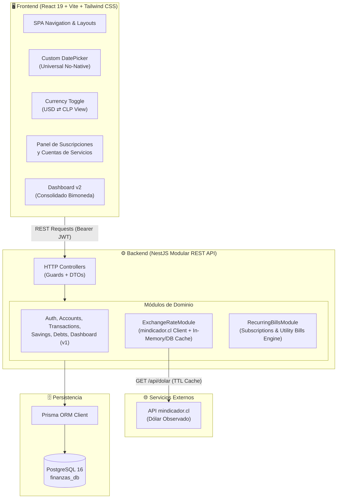
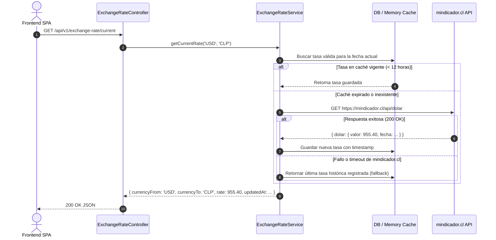
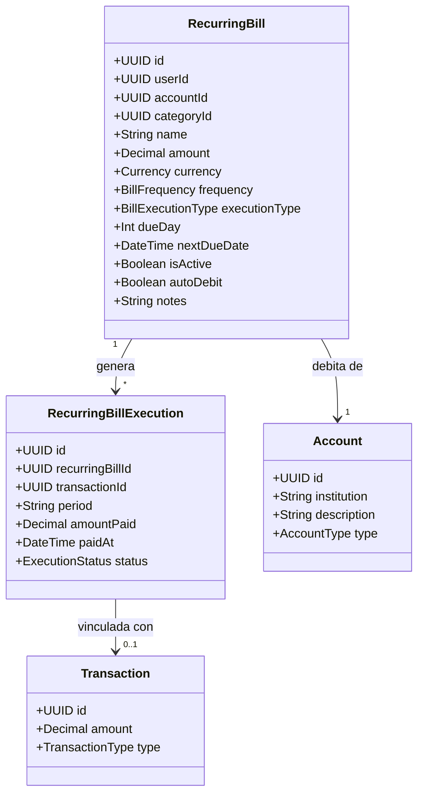

# 🏛️ Documento de Diseño del Sistema (SDD) - Arquitectura v2.0

## 1. Introducción y Objetivos de la v2.0

La **Versión 2.0** expande las capacidades del núcleo financiero construido en la v1.0, incorporando:
1. **Inteligencia Multimoneda en Tiempo Real:** Servicio de consulta y almacenamiento en caché del tipo de cambio oficial (USD ⇄ CLP) utilizando la API de `mindicador.cl`.
2. **Motor de Pagos Recurrentes y Suscripciones:** Automatización de cobros fijos en tarjetas de crédito (PAT) y control asistido con confirmación manual para cuentas de servicios básicos.
3. **Localización Financiera Chilena:** Modelado de instituciones bancarias locales y subtipos de cuenta como CuentaRUT/Vista.
4. **Desacoplamiento del Frontend y Selectores Nativos:** Abstracción completa de componentes de entrada de fecha multiplataforma.

---

## 2. Diagrama de Arquitectura de Contenedores y Servicios (Modelo C4 Nivel 2)



---

## 3. Arquitectura del Backend para Nuevos Módulos

### 3.1. Módulo de Tipo de Cambio (`ExchangeRateModule`)

Diseñado bajo el patrón **Adapter / Cache-Aside** para garantizar alta disponibilidad y cero latencia:



### 3.2. Módulo de Pagos Recurrentes y Suscripciones (`RecurringBillsModule`)

Este módulo desacopla la definición del gasto recurrente de su ejecución contable en el historial de transacciones:



* **Modo Automático (`AUTOMATIC`):**
  * Para suscripciones vinculadas a tarjeta de crédito o cuenta bancaria.
  * Al llegar la fecha de vencimiento (`dueDay`), el sistema genera la transacción correspondiente con tipo `EXPENSE` y marca el período mensual como pagado.
* **Modo Manual con Confirmación (`MANUAL_CHECK`):**
  * Para cuentas de consumo variable o servicios básicos (Luz, Agua, Gas, Internet).
  * El sistema coloca el estado del ciclo en `PENDING` o `DUE_SOON`.
  * El usuario presiona el botón *"Marcar como pagado"* enviando la cuenta real y fecha efectiva de desembolso, lo cual genera la transacción atómica y actualiza el saldo de la cuenta elegida.

---

## 4. Arquitectura del Frontend y Principios de Diseño v2

```
frontend/src/
 ├── components/
 │    ├── common/
 │    │    ├── DatePicker/             # 🌟 Nuevo: Componente universal DatePicker
 │    │    │    ├── DatePicker.tsx     # Popover / Modal responsive
 │    │    │    ├── CalendarGrid.tsx   # Grilla de días y selección
 │    │    │    └── MonthYearHeader.tsx# Navegación rápida de mes y año
 │    │    ├── CurrencyToggle.tsx      # 🌟 Nuevo: Switch interactivo USD ⇄ CLP
 │    │    └── BankBadge.tsx           # 🌟 Nuevo: Iconos e insignias de bancos chilenos
 ├── features/
 │    ├── recurring/                   # 🌟 Nuevo Módulo de Pagos Recurrentes
 │    │    ├── components/
 │    │    │    ├── RecurringBillCard.tsx
 │    │    │    ├── CreateRecurringModal.tsx
 │    │    │    └── MarkAsPaidModal.tsx
 │    │    ├── hooks/
 │    │    │    └── useRecurringBills.ts
 │    │    └── pages/
 │    │         └── RecurringBillsPage.tsx
 │    ├── accounts/                    # Actualizado con bancos e iconos locales
 │    ├── dashboard/                   # Actualizado con balance bimoneda en vivo
 │    └── transactions/                # Integrado con DatePicker universal
 ├── services/
 │    ├── api.ts                       # Axios base
 │    └── exchangeRateService.ts       # 🌟 Cliente de tipo de cambio y caché local
 └── store/
      └── currencyViewStore.ts         # 🌟 Estado global de visualización de divisa
```

---

## 5. Estrategia de Convivencia y Compatibilidad con la v1.0

1. **Retrocompatibilidad de la Base de Datos:**
   * Todas las columnas nuevas en tablas existentes (`accounts.description`, `accounts.institutionCode`) son opcionales (`Nullable`).
   * No se modifican los registros existentes en `transactions`, `saving_goals` ni `debt_loans`.
2. **Desacoplamiento de Divisas:**
   * La base de datos continúa almacenando números exactos en la moneda original de cada cuenta.
   * La conversión de divisa opera como una capa de presentación y proyección analítica, sin distorsionar los balances contables almacenados.
3. **Mantenimiento de la Suite de Pruebas:**
   * Las 26 pruebas unitarias y 10 pruebas E2E de la v1.0 deben mantenerse en estado verde durante toda la evolución de la v2.0.
