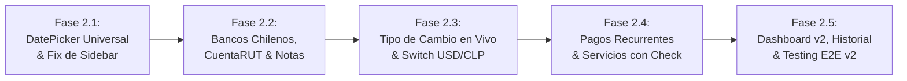

# 🚀 Plan de Desarrollo y Roadmap de Implementación v2.0

Este documento desglosa la construcción de la **Versión 2.0** en fases incrementales y testeables, garantizando la estabilidad de la v1.0 y una integración fluida de los nuevos módulos.

---

## 1. Metodología y Reglas de Desarrollo

* **Commits:** Apego irrestricto a **Conventional Commits**:
  * `feat: ... (v2)` para nuevas funcionalidades.
  * `fix: ... (v2)` para resolución de incidencias.
  * `refactor: ... (v2)` para optimizaciones sin cambio funcional.
  * `test: ... (v2)` para nuevas suites de pruebas.
* **Calidad de Código:**
  * Tipado TypeScript 100% estricto sin uso de `any`.
  * Cero advertencias de linter (`oxlint`).
  * Mantenimiento de la suite de pruebas previa en verde (26 unitarias + 10 E2E de v1.0).

---

## 2. Mapa de Fases de la Versión 2.0

---

### 📋 Fase 2.1: DatePicker Universal Multiplataforma y Fix del Sidebar
* **Objetivos:**
  * Construir el componente [`DatePicker.tsx`](file:///C:/Users/estee/Documents/Proyectos/Antigravity/finanzas/frontend/src/components/common/DatePicker) suprimiendo los inputs nativos de Android, iOS, Windows y macOS.
  * Modalidad dual: Popover en Desktop (≥768px) y Bottom Sheet Drawer en Mobile (<768px).
  * Soporte para selector rápido de año, mes, día, botones *"Hoy"* y *"Limpiar"*.
  * Reemplazar los selectores nativos en:
    * `CreateTransactionModal`
    * `CreateAccountModal`
    * `SavingsPage` (Aporte, Retiro y Creación de Meta)
    * `DebtsPage` (Creación de Deuda y Abono)
  * Corregir el bug visual de animación y overflow en el sidebar colapsable.
* **Criterio de Aceptación (DoD):**
  * Al hacer clic en cualquier campo de fecha en móvil o escritorio, se abre el DatePicker custom sin saltos ni teclado nativo del sistema operativo.
  * El sidebar colapsa y expande con transición continua de 300ms sin corte del logo ni parpadeo anticipado de texto.

---

### 📋 Fase 2.2: Catálogo de Instituciones Chilenas, CuentaRUT y Metadatos
* **Objetivos:**
  * Migración de Prisma para agregar `SIGHT_ACCOUNT` y `LOAN_ACCOUNT` a `AccountType`.
  * Agregar columnas `institutionCode` y `description` a la tabla `accounts`.
  * Catálogo preconfigurado de bancos chilenos en Frontend (BancoEstado, Santander, Banco de Chile, BCI, Scotiabank, Itaú, Falabella, Ripley, Tenpo, Mach, etc.) con sus logos y colores corporativos.
  * Actualizar formulario de creación y edición de cuentas con el selector de banco y campo de descripción.
  * Renderizar badges de banco e indicadores de Cuenta Vista / CuentaRUT en las tarjetas de cuenta.
* **Criterio de Aceptación (DoD):**
  * Un usuario puede registrar una *"CuentaRUT BancoEstado"* seleccionando la institución del catálogo, asignándole una descripción personalizada y viendo su badge e insignia en la grilla de cuentas.

---

### 📋 Fase 2.3: Servicio de Tipo de Cambio en Vivo (mindicador.cl) y Switch Bimoneda
* **Objetivos:**
  * Crear `ExchangeRateModule` en Backend con cliente HTTP para consumir `https://mindicador.cl/api/dolar`.
  * Tabla/caché de tasas en base de datos (`ExchangeRateCache`) con TTL de 12 horas y fallback automático en caso de timeout del servicio externo.
  * Endpoint `GET /api/v1/exchange-rate/current?from=USD&to=CLP`.
  * Componente Frontend `CurrencyToggle` que permite alternar la vista entre monto en USD y su equivalente en CLP según la tasa del día.
  * Integrar el switch en las tarjetas de cuentas en USD, deudas/préstamos en USD y transacciones asociadas.
  * Consolidar el cálculo de patrimonio en el Dashboard convirtiendo cuentas USD a CLP.
* **Criterio de Aceptación (DoD):**
  * Una cuenta con `US$ 1,500.00` muestra un botón switch interactivo que al presionarlo calcula y despliega `$1.432.950 CLP (Tasa: $955,30)` en tiempo real.

---

### 📋 Fase 2.4: Módulo de Pagos Recurrentes, Suscripciones y Cuentas de Servicios
* **Objetivos:**
  * Migración de Prisma con modelos `RecurringBill` y `RecurringBillExecution`.
  * Crear módulo `RecurringBillsModule` en NestJS:
    * `POST /recurring-bills` (Crear suscripción o servicio).
    * `GET /recurring-bills` (Listado con estado del ciclo del mes actual).
    * `POST /recurring-bills/:id/mark-paid` (Confirmación manual de pago con generación de transacción atómica vinculada).
    * `GET /recurring-bills/summary` (Resumen de gasto fijo mensual, pagado y restante).
  * Vista Frontend `/recurring` con:
    * Indicadores de gastos fijos mensuales.
    * Grilla de servicios distinguiendo entre **Débito Automático (PAT/TC)** y **Pago Manual (Cuentas de Luz/Agua/Gas)**.
    * Botón con check *"Marcar como pagado"* que abre modal de confirmación con selección de cuenta y fecha.
* **Criterio de Aceptación (DoD):**
  * El usuario registra una cuenta de *"Luz Enel"* por $25.000 con vencimiento el día 12. Al presionar *"Marcar como pagado"* y confirmar débito de su Cuenta Corriente, se descuenta el saldo de la cuenta, se crea la transacción en el historial y el servicio pasa a estado verde *"Pagado este mes"*.

---

### 📋 Fase 2.5: Integración con Dashboard v2, Historial y Calidad Final
* **Objetivos:**
  * Actualizar el Dashboard con widget de servicios y pagos recurrentes por vencer en la semana.
  * Pestaña de historial mensual de pagos recurrentes para auditar meses anteriores.
  * Suites de pruebas unitarias y E2E para `ExchangeRateService` y `RecurringBillsService`.
  * Verificación de linters, builds y pipeline de GitHub Actions en verde.
  * Generación del tag de versión `v2.0.0`.
* **Criterio de Aceptación (DoD):**
  * Suite de pruebas completa pasando al 100% y despliegue exitoso de la versión 2.0.0 en el repositorio.
